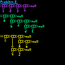
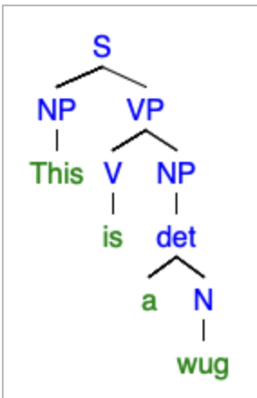
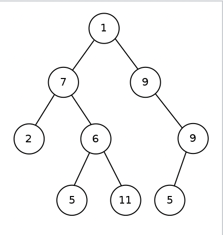
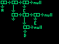

# Homework 2 - Scheme
[Link to the Repl](https://replit.com/@thebees86/QuizzicalFoolhardyMinimalsystem)


1.  **Write a scheme expression for each of the following arithmetic expressions:**
    1.  **`1 + 2`**\
		`(+ 1 2)`
    2.  **`2 * 3 + 4 * 2`**\
		`(+ (* 3 2) (* 4 2))`
    3.  **`1 - 8 / 4 + 3`**\
		`(+ (- 1 (/ 8 4)) 3)`
    4.  **`1 + 2 + 3 + 4 + 5`**\
		`(+ 1 (+ (+ 2 3) (+ 4 5)))`
    5.  **`-1 - 2 - 3 - 4`**\
		`(-(-(-(-(- 0 1) 2) 3) 4) 5)`
    6.  **What is, in your opinion, a benefit of prefix notation when it comes to clarity?**\
	Prefix notation, while somewhat confusing at first, makes math somewhat more human-understandable by seperating math into small blocks by operation instead of a long chain using order of operations
    7.  **[optional] What is, in your opinion, a shortcoming of prefix notation when it comes to clarity?**\
		Prefix notation only allows operations on two elements at once, and involves quite a few parentheses
---
2.  **Draw box-pointer diagrams for each of the following lists. You may take clear photographs of hand-drawn diagrams**
    1.  `'(1 2 3 4)`
    2.  `'(a (b c (d e)))`
    3.  `'(x (y z) (a b))`\
	\
    **Write all valid combinations of `car` and `cdr` that can be applied to the list in `c`.
        For example,** `(car (cdr '(1 2 3)))` **is valid, but** `(car (car '(1 2 3)))` **is not because the inner **`car`** results in `1`.**\

		`(define c '(x (y z) (a b)))`\
		`(car c)							;returns x`\
		`(cdr (car (car c)))				;returns y`\
		`(cdr (car (cdr (car c))))		;returns z`\
		`(cdr (cdr (car (car c))))		;returns a`\
		`(cdr (cdr (car (cdr (car c)))))	;returns b`
---
3.  Convert each of the following trees into a quoted list in scheme
    1.  
    2.  
    3.  Draw a tree of your own with at least 5 nodes, at least one node that is of depth 3, and 2 nodes with more than 1 child. You may give the nodes labels as you please.\
		
---
4.  Write the following functions in scheme and provide a few test cases. Use the `display` function to format your output.
    1.  **The pre-defined procedures `min` and `max` each take two arguments and return the smallest/largest of the two, or the first argument if they are both equal.
        Define `lmin` and `lmax` which apply these functions to lists of numbers.**
		```
		(define (lMax L)
		  (cond
			  ((eq? (cdr L) '()) (car L))
			  (else (max (car L)(lMax (cdr L))))
		   ))

		(display "===Max===")
		(newline)
		(display (lMax '(-12 100 1230998235987129835)))
		(newline)
		(display (lMax '(-102 1 -1 0)))
		(newline)
		(display (lMax '(12 -102848 0 0)))
		(newline)
		(display (lMax '(10 100 2)))
		(newline)

		(define (lMin L)
		  (cond
			((eq? (cdr L) '()) (car L))
			(else (min (car L)(lMin (cdr L))))
		   ))

		(newline)
		(display "===Min===")
		(newline)
		(display (lMin '(-12 100 1230998235987129835)))
		(newline)
		(display (lMin '(-102 1 -1 0)))
		(newline)
		(display (lMin '(12 -102848 0 0)))
		(newline)
		(display (lMin '(10 -100 2)))
		(newline)
		```
    2.  **The predefined procedure** `list?` **checks if the argument is a valid list. Implement your own version of it. *HINT: your procedure might get arguments that are not lists or pairs at all. You may use*** *`pair?`* ***in your function.***
	
		```
		(define (isList L)
		  (cond
		   ((not (pair? L)) #f)
		   ((eq? (cdr L) '()) #t)
		   (else (isList (cdr L)))
		))

		(newline)
		(display "===list?===")
		(newline)
		(display (isList '(1 5)))
		(display " <-should be true")
		(newline)
		(display (isList 1))
		(display " <-should be false")
		(newline)
		(display (isList '(1)))
		(display " <-should be true")
		(newline)
		```
    3.  **Implement** `deep-sum`**, where given an arbitrarily nested list of numbers in scheme,** `deep-sum` **the sum of all the numbers. That is, your input list may have sublists, which may themselves have sublists and so on.**
		```
		(define (deep-sum L)
		  (cond
		   ((not (isList L)) 0)
		   ((eq? (cdr L) '()) (car L))
		   ((list? (car L)) (+ (deep-sum(cdr L)) (deep-sum (car L))) )
		   (else  (+ (deep-sum (cdr L)) (car L)))
		   ))
		(newline)
		(display "===deep-sum===")
		(newline)
		(display (deep-sum '(1 1)))
		(display " <-should be 2")
		(newline)
		(display (deep-sum 12))
		(display " <-should be 0")
		(newline)
		(display (deep-sum '(1 (1 1) 1)))
		(display " <-should be 4")
		(newline)
		(display (deep-sum '(1 (1 1 (1 1)1) 1)))
		(display " <-should be 7")
		(newline)
		```
---
5.  **PRIME NUMBERS:
    Write a procedure** `(nprimes k)` **which returns the first** `k` **prime numbers. You may need to implement multiple functions to make this work. Try to make it as efficient as possible (ie, as few unnecessary computations as possible).
    Implement this problem in a separate file.**
	```
	(define (length? L)
	  (cond
	   ((eq? L '()) 0)
	   ((eq? (cdr L) '()) 1)
	   (else (+ 1 (length? (cdr L))))
	   ))

	(define (last L)
	  (cond
	   ((eq? L '()) '())
	   ((eq? (cdr L) '()) (car L))
	   (else (last (cdr L)))
	   ))

	(define (not-prime L n)
	  (cond
	   ((eq? (cdr L) '()) (eq? 0 (mod n (car L))))
	   (else (or (eq? 0 (mod n (car L))) (not-prime (cdr L) n)))
	   ))

	(define (next-prime L n)
	  (cond       
	   ((not (not-prime L n)) (list n))
	   (else (next-prime L (+ n 1)))
	  ))

	(define (nprimes k)  (cond
	   ((eq? k 0) '())
	   ((eq? k 1) '(2)) ;2 is the first prime number, since I think 1 is a special case
	   (else ;This part is still WIP
		(define L (nprimes (- k 1)))
		(append L (next-prime L (+ 1 (last L))))    )   
						  ))

	(display (nprimes 20))(newline)
	```
---
6.  **Implement** `merge-sort` **in Scheme**
	```
	(define (length? L)
	  (cond
	   ((eq? L '()) 0)
	   ((eq? (cdr L) '()) 1)
	   (else (+ 1 (length? (cdr L))))
	   ))

	(define (sublist L n) ;this code somehow worked first try!
	  (cond   ((eq? (cdr L) '()) '())
	   ((<= (length? L) n) L) ;Base case
	   ((eq? n 0) '())
	   (else (append (list (car L)) (sublist (cdr L) (- n 1))))
	   ))

	(define (rlist L n)
	  (display n)(newline)
	  (cond   
	   ((> n 1) (rlist (cdr L) (- n 1)))
	   (else (cdr L))
	   ))

	(define (merge-sort L)
	  (cond   
	   ((eq? L '()) L)
	   ((eq? (cdr L) '()) L)
	   (else (merge (merge-sort (rlist L (/ (length? L) 2))) (merge-sort (sublist L (/ (length? L) 2)))
	   ))
	   ))

	(define (merge L1 L2)
	  (cond 
		((eq? L2 '()) L1)
		(else (merge (insert L1 (car L2)) (cdr L2)))
	   ))

	(define (insert L n)
	  (cond
	   ((eq? L '()) (list n))
	   ((> n (car L)) (append (list (car L)) (insert (cdr L) n)))
	   (else (append (list n) L))
	   ))
	  
	(display "===Sort===")(newline)
	;(display (insert '(1 2 3) 3)) (newline)
	(display (merge-sort '(2 8 19 4)))(newline)
	```
---
7.  `(nsum L n)` **takes in a list** `L` **and a number** `n` **and returns a resulting list where the** i &rsquo;th **element is the sum of the elements from position** `i` **to** `(min (length? L) i+n)`**.**
    
    **For example** `(nsum '(2 3 12 4) 3) => '(17 19 16 4)`
    
    **Implement** `nsum`
	```
	(define (length? L)
	  (cond
	   ((eq? L '()) 0)
	   ((eq? (cdr L) '()) 1)
	   (else (+ 1 (length? (cdr L))))
	   ))

	(define (sublist L n) ;this code somehow worked first try!
	  (cond
	   ((<= (length? L) n) L) ;Base case
	   ((eq? n 0) '())
	   (else (append (list (car L)) (sublist (cdr L) (- n 1))))
	   ))

	(define (nsum L n)
	  (cond
	  ((eq? (cdr L) '()) L)
	  (else (append (list(fold-left + 0 (sublist L n))) (nsum (cdr L) n)))
	   ))

	(display (nsum '(2 3 12 4) 3))
	```
